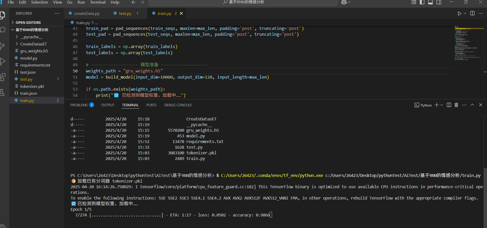
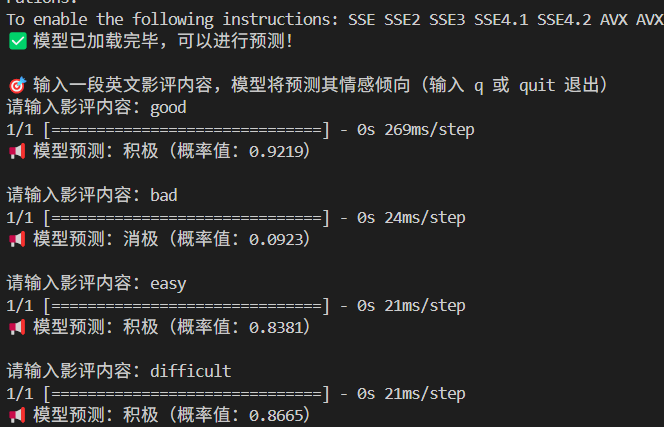

# 📌 Introduction介绍

在AI的世界里，**大语言模型（LLM）**已经成为了技术发展的前沿。ChatGPT、DeepSeek、Qwen等惊艳的模型几乎重新定义了我们对智能的理解。它们通过数百亿个参数，展现出了超凡的语言理解和生成能力，令人叹为观止。可惜的是，这些模型的庞大规模让它们在训练和部署上都成为了巨大的挑战，几乎让普通用户望而却步。

但你知道吗？如果我们能够亲手动手，**从零开始训练一个极小的语言模型**，那种成就感和创造力的激发，将会是一次无与伦比的体验！而这个项目的目标，正是让每个人都能迈出这一步！我们不仅仅满足于**使用**现有的大模型，而是希望通过亲手训练模型，深入理解背后的每一行代码。

通过这个项目，你将**构建并训练一个极简的情感分类模型**，不仅仅是简单的推理，而是从零开始实现！你会从数据处理、模型设计到训练过程中的每一个细节都亲自经历，逐步建立对深度学习、神经网络以及情感分析模型的理解。

**项目亮点**：

- **情感分类**：你将构建一个情感分类模型，处理英文影评数据，预测影评的情感倾向（积极或消极）。这不仅是对自然语言处理的挑战，更是对你模型训练能力的锻炼！
- **完整的训练流程**：你会体验到完整的**从数据预处理、分词、构建模型到训练与评估**的全过程，进一步深入理解深度学习的每一个细节。
- **实际部署**：从构建到训练，你的模型将具备实际部署能力，可以实时预测新的影评情感，确保学到的知识能应用于实际问题。
- **低成本**：无需高配服务器，整个项目可以在最低成本的设备上运行，让你体验到极低门槛的AI项目实践。

最重要的是，这一切不再是遥不可及的梦想！你只需以**本机CPU**，就能亲自体验如何从0到1，逐步训练并部署一个情感分类模型。

加入这个项目，挑战自己的极限，揭开大语言模型背后的神秘面纱，让我们一起感受AI创造的无穷魅力吧！

# 📌 Quick-Start快速开始

**python版本**Python 3.8.18

## 第0步

```
git clone https://github.com/TomSpeaker/RNN-of-GRU-classify-2-emotion.git
```

**相关依赖包**

```
pip install -r requirements.txt
```

**项目结构**

```
└─RNN-of-GRU-classify-2-emotion
    │  README.md
    │
    └─基于RNN的情感分析
        │  gru_weights.h5
        │  model.py
        │  requirements.txt
        │  test.py
        │  tokenizer.pkl
        │  train.py
        │
        ├─CreateDatasET
        │      createData.py
        │      test-00000-of-00001.parquet
        │      test.json
        │      train.json
        │
        └─__pycache__
                model.cpython-38.pyc
```

# 📌 Dataset-Solve数据集处理

## ⅠDataset-Introduction数据集介绍

来自imdb（IMDB 数据集（Internet Movie Database）是一个经典的**情感分类任务**数据集，主要用于训练和评估**自然语言处理（NLP）模型**的情感分析能力。）[对应的链接](https://hf-mirror.com/datasets/stanfordnlp/imdb)

本项目使用的是其中plain_text/test-00000-of-00001.parquet

## Ⅱ Dataset-processing数据集的处理

**CreateDatasET\createData.py**

1. **加载数据集**：
   - 使用 `datasets` 库加载本地的 `test-00000-of-00001.parquet` 文件，格式为 Parquet。
   - 加载的数据集存储在 `dataset["train"]` 中。
2. **转换为 DataFrame**：
   - 使用 `pandas` 将加载后的数据转换为 `DataFrame`，方便处理。
3. **划分数据集**：
   - 使用 `train_test_split` 将数据集按 70%：30% 的比例划分为训练集和测试集，并保持 `label` 类别的分布一致（stratify）。
4. **保存为 JSON**：
   - 自定义函数 `save_dataset_to_json` 将训练集和测试集分别保存为 `train.json` 和 `test.json`。
   - 每条数据以字典形式保存，包括两个字段：
     - `"label"`：情感标签（0 或 1）
     - `"text"`：影评文本（自动去除换行和首尾空格）
5. **最终输出**：
   - 程序运行结束后，控制台会打印提示：`数据集划分并保存成功 ✅`

执行完毕后，得到训练集和测试集（`train.json` 和 `test.json`）。

# 📌 Model-Design模型设计

model.py

**Embedding 层**（词向量嵌入）：

- **功能**：将输入的词索引序列（如 `[12, 78, 546, ...]`）转换为稠密的向量表示。
- **参数**：
  - `input_dim=10000`：词汇表大小为 10000。
  - `output_dim=128`：每个词被映射为一个 128 维的向量。
  - `input_length=200`：每条文本最多包含 200 个词。

**GRU 层**（门控循环单元）：

- **功能**：用于提取文本序列中的时序特征。
- **参数**：
  - `units=128`：隐藏状态维度为 128。
  - `return_sequences=False`：只返回序列的最终状态，用于后续分类任务。

**全连接层 Dense(64)**：

- **功能**：将 GRU 提取到的语义特征进一步映射到更高维空间。
- **激活函数**：ReLU，用于增加模型非线性表达能力。

**输出层 Dense(1)**：

- **功能**：输出一个标量，表示属于“积极情感”的概率。
- **激活函数**：Sigmoid，输出值在 0~1 之间，用于二分类判断。

# 📌 Model-Train模型训练

**train.py**

**1. 加载数据（`load_data`）**

从保存好的 `train.json` 和 `test.json` 中读取文本和标签数据，分别用于训练和测试。

**2. 文本预处理**

- 利用 `Tokenizer` 对文本进行分词和数字化编码。
- 若存在已保存的分词器 `tokenizer.pkl`，则直接加载；否则训练新的分词器并保存。
- 将文本序列统一填充（或截断）为长度为 `200`，以便喂入模型中。

**3. 模型准备**

- 使用自定义的 `build_model()` 函数构建一个包含 Embedding + GRU + Dense 的情感分类模型。
- 如果本地已有训练好的权重 `gru_weights.h5`，则自动加载，方便继续训练或复现效果。

**4. 模型训练**

- 训练 5 个 epoch，批大小为 64。
- 使用 `binary_crossentropy` 作为损失函数，适用于二分类任务。
- 同时在测试集上进行验证，监控模型性能。

**5. 保存模型权重**

- 训练完成后，将模型权重保存为 `gru_weights.h5`，方便下次加载继续训练或推理。



# 📌 Model-Test模型测试

**test.py**

1. **模型和分词器加载**

- 自动加载训练阶段保存的分词器（`tokenizer.pkl`）和模型权重（`gru_weights.h5`）。
- 如果文件不存在，会给出清晰的错误提示，防止误操作。

2. **模型构建**

- 使用自定义的 `build_model()` 函数重新搭建模型结构（必须与训练时一致），并加载权重进行预测准备。

3. **交互式预测**

- 用户可以输入任意英文影评。
- 脚本将输入文本转化为模型可以识别的序列格式，并进行预测。
- 预测结果以“积极”或“消极”显示，并附带预测的概率值（sigmoid输出）。

4. **用户友好**

- 支持输入 `q` 或 `quit` 退出预测循环。
- 每一步都配有清晰的提示语和 Emoji 反馈，提升交互体验。

